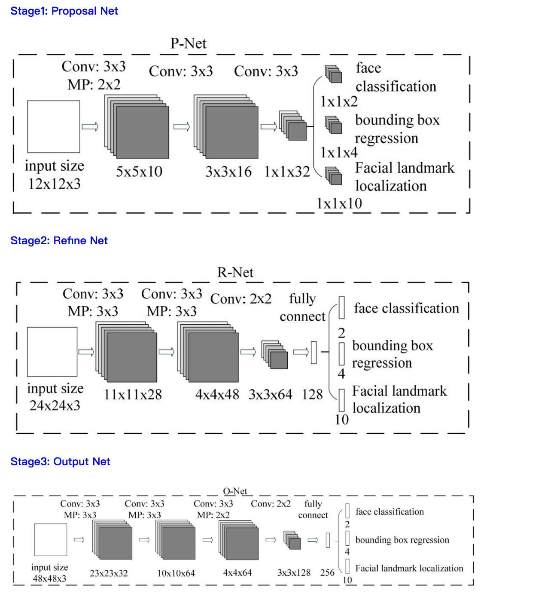

## 设计说明:
我们的总体实现分为两部分：MTCNN与opencv haar cascade进行。

大部门的图片我们都可以使用MTCNN进行处理，剩余的那些交给opencv进行捞底。

MTCNN网络模型如下：

## 修改代码说明：
我们借鉴了[facenet](https://github.com/davidsandberg/facenet)中MTCNN的实现，修改了其中`src/align/align_dataset_mtcnn.py`代码，插入了`opencv`捞底的功能，并结合大赛要求做了相应的改进。

## 训练模型文件:

`/home/nimbix/github/facenet/src/align`下的:

- det1.npy
- det2.npy
- det3.npy

`/home/nimbix/github/facenet/src/opencv/model`
下的:

- haarcascade_eye.xml
- haarcascade_frontalface_default.xml
- mouth.xml
- nose.xml

## 耗时

real    0m36.132s
user    0m44.304s
sys     0m3.732s

## 使用方法

启动 virtualenv

	 source /opt/DL/tensorflow/bin/tensorflow-activate

设置环境变量：

	 export PYTHONPATH=$PYTHONPATH:/home/nimbix/github/facenet/src

启动脚本

	 python /home/nimbix/github/facenet/src/align/my.py ~/input ~/result
	
预测结果在`result`下面。
	 
	 